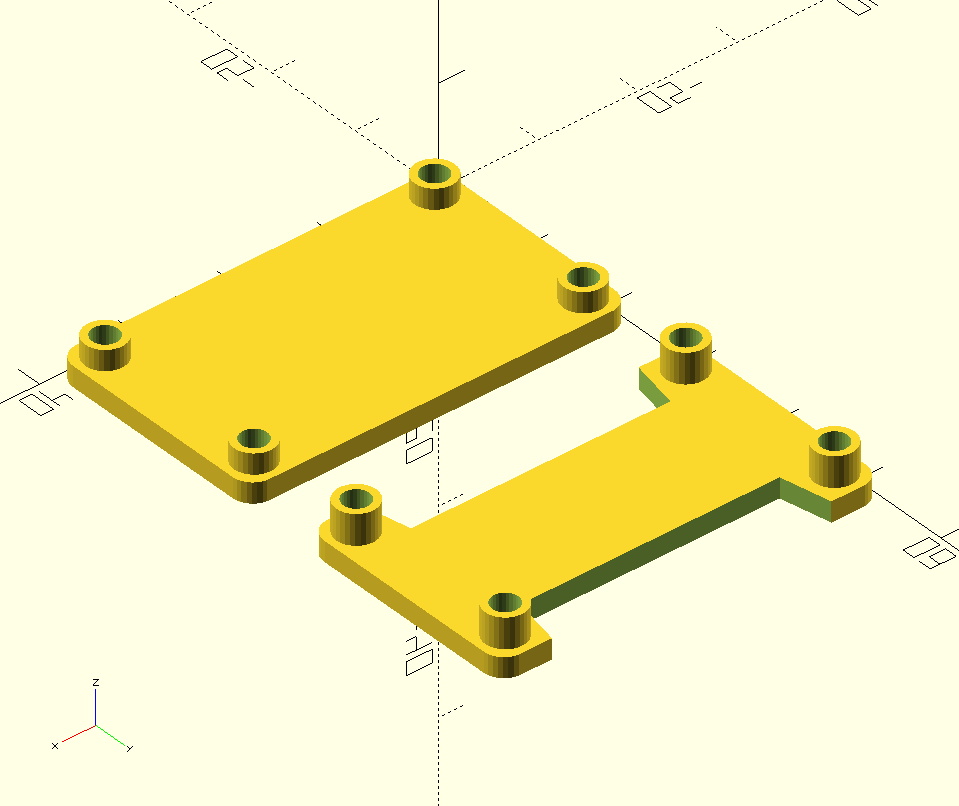

# Case for Bus Pirate v4 (and v3.6)
This is a SCAD Model for the FT232H IO Board from Adafruit.
 

## Usage

- call "ft232h\_plate()" or "ft232h\_plate_top()" to generate top and bottom of the case

**WORK IN PROGRESS!**
This Model for OpenSCAD has not been printed by me. I will upload photos
of the printed case.

 

 
 
 

# LICENSE

<dl>
 Dieses Werk ist lizenziert unter einer <a rel="license" href="http://creativecommons.org/licenses/by-sa/4.0/">Creative Commons Namensnennung - Weitergabe unter gleichen Bedingungen 4.0 International Lizenz</a>.
</dl>

<dl>
 This work is licensed under a <a rel="license" href="http://creativecommons.org/licenses/by-sa/4.0/">Creative Commons Attribution-ShareAlike 4.0 International License</a>.
</dl>
